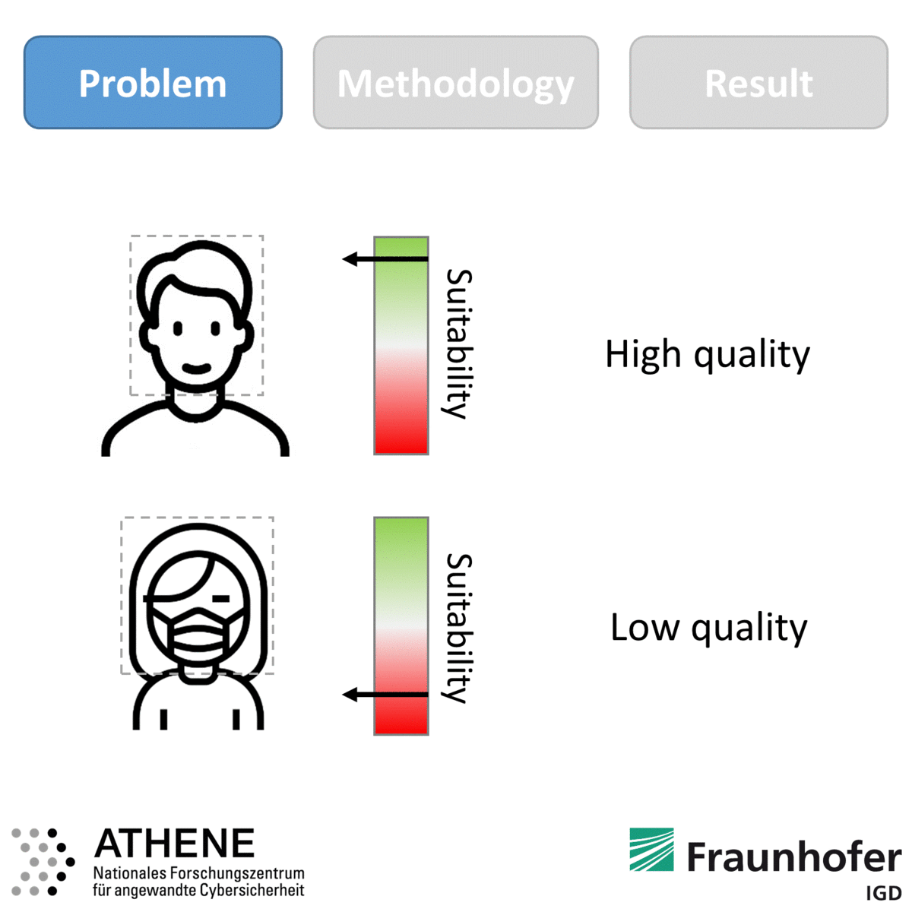
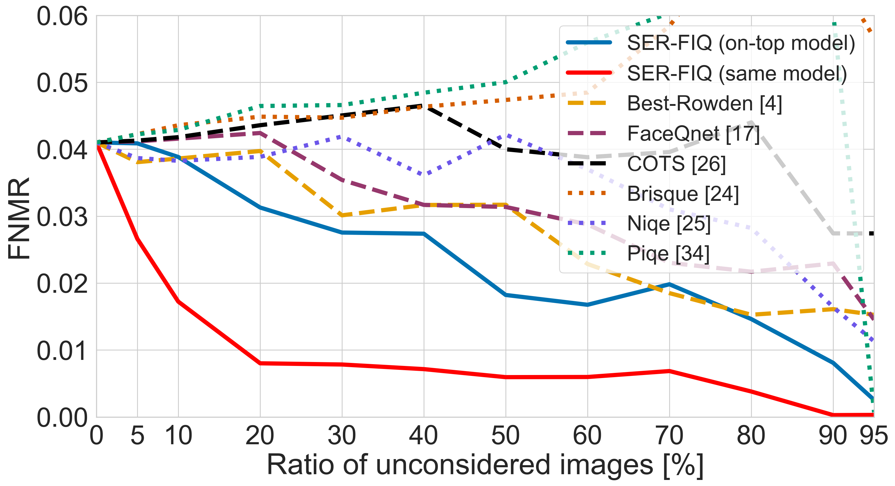
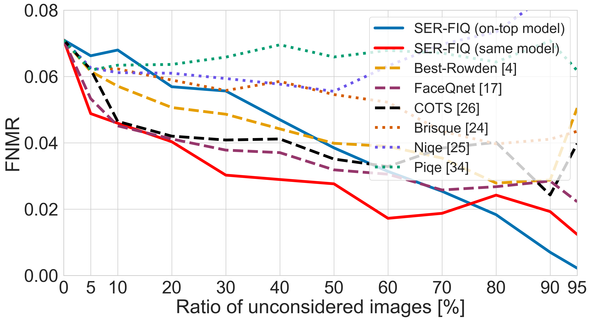

# Face Image Quality Assessment

***18.05.2020*** _Bias in FIQ was added._

***15.05.2020*** _SER-FIQ (CVPR2020) was added._

## SER-FIQ: Unsupervised Estimation of Face Image Quality Based on Stochastic Embedding Robustness

IEEE/CVF Conference on Computer Vision and Pattern Recognition (CVPR) 2020

* [Research Paper](https://arxiv.org/abs/2003.09373)
* [Implementation on ArcFace](face_image_quality.py)


## Table of Contents 

- [Abstract](#abstract)
- [Key Points](#key-points)
- [Results](#results)
- [Installation](#installation)
- [Bias in Face Quality Assessment](#bias-in-face-quality-assessment)
- [Citing](#citing)
- [Acknowledgement](#acknowledgement)
- [License](#license)

## Abstract



Face image quality is an important factor to enable high-performance face recognition systems. Face quality assessment aims at estimating the suitability of a face image for recognition. Previous works proposed supervised solutions that require artificially or human labelled quality values. However, both labelling mechanisms are error-prone as they do not rely on a clear definition of quality and may not know the best characteristics for the utilized face recognition system. Avoiding the use of inaccurate quality labels, we proposed a novel concept to measure face quality based on an arbitrary face recognition model. By determining the embedding variations generated from random subnetworks of a face model, the robustness of a sample representation and thus, its quality is estimated. The experiments are conducted in a cross-database evaluation setting on three publicly available databases. We compare our proposed solution on two face embeddings against six state-of-the-art approaches from academia and industry. The results show that our unsupervised solution outperforms all other approaches in the majority of the investigated scenarios. In contrast to previous works, the proposed solution shows a stable performance over all scenarios. Utilizing the deployed face recognition model for our face quality assessment methodology avoids the training phase completely and further outperforms all baseline approaches by a large margin. Our solution can be easily integrated into current face recognition systems and can be modified to other tasks beyond face recognition.

## Key Points

- Quality assessment with SER-FIQ is most effective when the quality measure is based on the deployed face recognition network, meaning that **the quality estimation and the recognition should be performed on the same network**. This way the quality estimation captures the same decision patterns as the face recognition system.
- To get accurate quality estimations, the underlying face recognition network for SER-FIQ should be **trained with dropout**. This is suggested since our solution utilizes the robustness against dropout variations as a quality indicator.
- The provided code is only a demonstration on how SER-FIQ can be utilized. The main contribution of SER-FIQ is the novel concept of measuring face image quality.
- If the last layer contains dropout, it is sufficient to repeat the stochastic forward passes only on this layer. This significantly reduces the computation time to a time span of a face template generation.

## Results

Face image quality assessment results are shown below on LFW (left) and Adience (right). SER-FIQ (same model) is based on ArcFace and shown in red. The plots show the FNMR at  FMR as recommended by the [best practice guidelines](https://op.europa.eu/en/publication-detail/-/publication/e81d082d-20a8-11e6-86d0-01aa75ed71a1) of the European Border Guard Agency Frontex. For more details and results, please take a look at the paper.

  

## Installation

We recommend Anaconda to install the required packages.
This can be done by creating an virtual environment via

```shell
conda env create -f environment.yml
```

or by manually installing the following packages.


```shell
conda create -n serfiq python=3.6.9
conda install cudatoolkit
conda install cudnn
conda install tensorflow=1.14.0
conda install mxnet
conda install mxnet-gpu
conda install tqdm
conda install -c conda-forge opencv
conda install -c anaconda scikit-learn
conda install -c conda-forge scikit-image
conda install keras=2.2.4
```

The implementation for SER-FIQ based on ArcFace can be found here: [Implementation](face_image_quality.py). <br/>
In the [Paper](https://arxiv.org/abs/2003.09373), this is refered to _SER-FIQ (same model) based on ArcFace_. <br/>
An example on how to apply the code is shown here: [Sample Code](serfiq_example.py). 


## Bias in Face Quality Assessment

The best face quality assessment performance is achieved when the quality assessment solutions build on the templates of the deployed face recognition system.
In our work on ([Face Quality Estimation and Its Correlation to Demographic and Non-Demographic Bias in Face Recognition](https://arxiv.org/abs/2004.01019)), we showed that this lead to a bias transfer from the face recognition system to the quality assessment solution.
On all investigated quality assessment approaches, we observed performance differences based on on demographics and non-demographics of the face images.


  

  


## Citing

If you use this code, please cite the following papers.


```
@article{DBLP:journals/corr/abs-2003-09373,
  author    = {Philipp Terh{\"{o}}rst and
               Jan Niklas Kolf and
               Naser Damer and
               Florian Kirchbuchner and
               Arjan Kuijper},
  title     = {{SER-FIQ:} Unsupervised Estimation of Face Image Quality Based on
               Stochastic Embedding Robustness},
  journal   = {CoRR},
  volume    = {abs/2003.09373},
  year      = {2020},
  url       = {https://arxiv.org/abs/2003.09373},
  archivePrefix = {arXiv},
  eprint    = {2003.09373},
  timestamp = {Tue, 24 Mar 2020 16:42:29 +0100},
  biburl    = {https://dblp.org/rec/journals/corr/abs-2003-09373.bib},
  bibsource = {dblp computer science bibliography, https://dblp.org}
}
```

```
@article{DBLP:journals/corr/abs-2004-01019,
  author    = {Philipp Terh{\"{o}}rst and
               Jan Niklas Kolf and
               Naser Damer and
               Florian Kirchbuchner and
               Arjan Kuijper},
  title     = {Face Quality Estimation and Its Correlation to Demographic and Non-Demographic
               Bias in Face Recognition},
  journal   = {CoRR},
  volume    = {abs/2004.01019},
  year      = {2020},
  url       = {https://arxiv.org/abs/2004.01019},
  archivePrefix = {arXiv},
  eprint    = {2004.01019},
  timestamp = {Wed, 08 Apr 2020 17:08:25 +0200},
  biburl    = {https://dblp.org/rec/journals/corr/abs-2004-01019.bib},
  bibsource = {dblp computer science bibliography, https://dblp.org}
}
```

If you make use of our SER-FIQ implementation based on ArcFace, please additionally cite the original .

## Acknowledgement

This research work has been funded by the German Federal Ministry of Education and Research and the Hessen State Ministry for Higher Education, Research and the Arts within their joint support of the National Research Center for Applied Cybersecurity ATHENE. 

## License 

This project is licensed under the terms of the Attribution-NonCommercial-ShareAlike 4.0 International (CC BY-NC-SA 4.0) license.
Copyright (c) 2020 Fraunhofer Institute for Computer Graphics Research IGD Darmstadt
